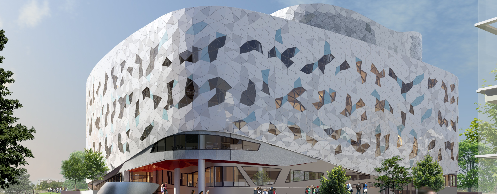

# Huseyn Akhundov

I'm a Computer Science student at the Lassonde School of Engineering. I greatly enjoy open-source software and take pride in teamwork 🌱

## Featured Project
#### <ins>Investment Portfolio</ins>
[Click for live demo](https://huseynakh.github.io/InvestmentPortfolio/)

## Languages and Skills
**Languages:** JavaScript, C, Python, Java, Solidity, HTML, CSS, Bash  
**Hardware:** RISC-V, Verilog  
**General:** React.js, Node.js, Arduino, Linux (Debian, Fedora), Git, Server administration  
**Development:** Software: IntelliJ, Atom, Visual Studio Code, Eclipse, Nano  

## Connect With Me  

